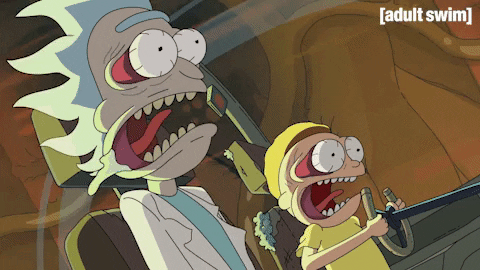

# Pascal Georges
## Professional retraining

Passionate about illustration, animation and programming, fields that allow me to combine creativity and technique. My interest is particularly in 2D and 3D character animation, as well as video game development. I have a constant desire to learn new techniques to refine my skills and bring ever more captivating projects to life. I dream of thriving in an environment where I could create unique visual worlds, while taking on stimulating challenges. Each project is an opportunity to learn, innovate and express my passion on a daily basis.

As part of web development, I make it a point of honor to optimize my projects for SEO and responsive design. It was with the aim of improving my productions that I started to study the Bootstrap framework as well as various other JS frameworks.

<procedure title="Surprising skills">
<step>Character designer</step>
<step>Making Special MakeUp</step>
<step>Cooking</step>
</procedure>

<procedure title="three things I like the most in this universe">
<step>3d sculpture</step>
<step>Write screenplays and novels</step>
<step>Create video games</step>
</procedure>

<procedure title="The objectives I want to achieve as a developer during Becode">
<step>becoming independent</step>
<step>Learning several frameworks</step>
<step>working on great projects</step>
</procedure>

## The fears I might have

Must have a high level of math to advance deeply in the code.

## The things I look forward to

Create my first dynamic site from a to z.

<procedure title="The three things I value the most in working as a team">
<step>Team support</step>
<step>The exchange of ideas</step>
<step>That the project can benefit from each of the skills of the team members</step>
</procedure>

## My favorite GIF

